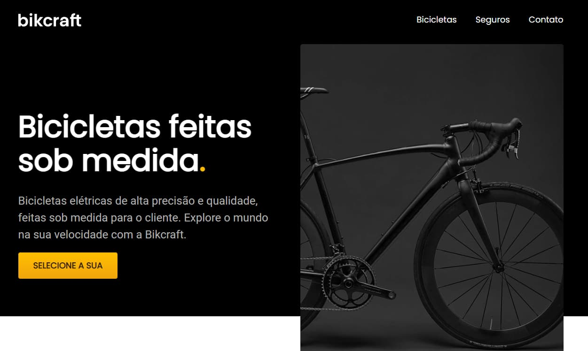

<h1 align="center"> Bikcraft (2021) </h1>

  

## Projeto

Projeto consiste em um site de uma loja de bicicletas.

O objetivo do repositório é praticar HTML, CSS e Javascript.

Para acessar o projeto, basta [clicar aqui](https://danieldpalma.github.io/bikcraft-2021/).

Projeto feito pelo curso da [Origamid](https://www.origamid.com/).

## Tecnologias

Para este projeto foram usadas as seguintes tecnologias:

- HTML
- CSS
- Javascript
